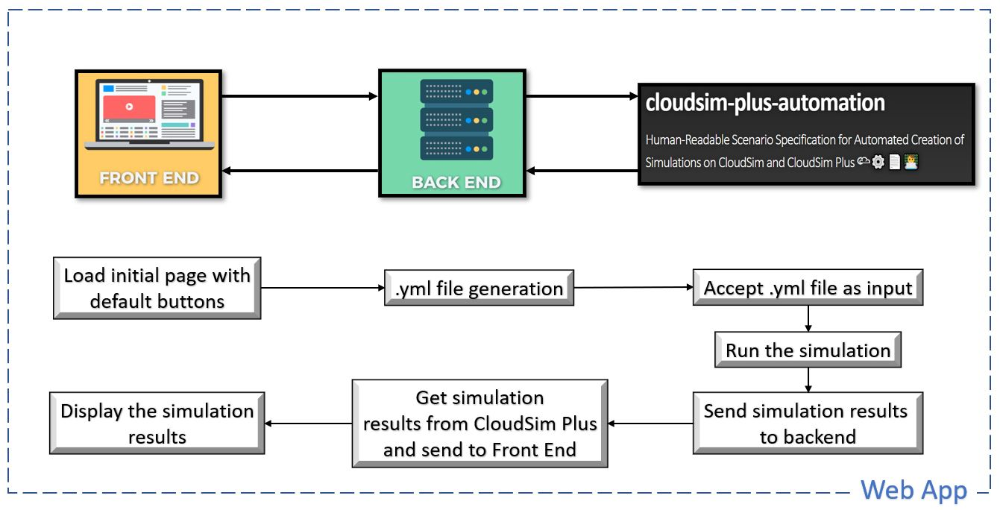
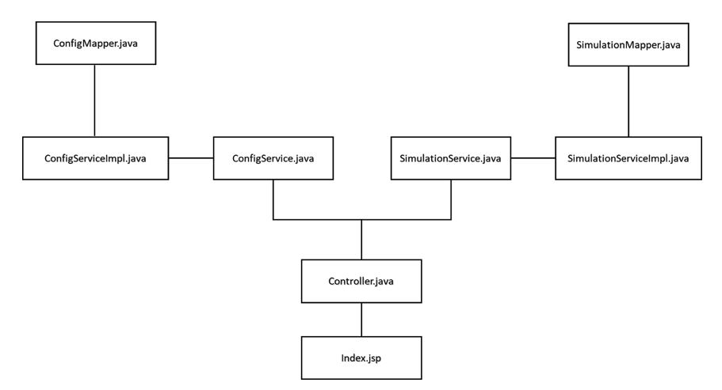

## UIC CS 540 - Advanced Software Engineering

## Course Project - CloudSim Plus Modeler

## Overview

In this project, we aim to enable users to design their Cloud Architecture model pictorially and run the simulation scenarios on [CloudSim Plus](https://cloudsimplus.org/) framework accordingly. The project provides a User Interface with drag-and-drop features to select and set the attribute values of the architectural components viz. datacenters, hosts, virtual machines and cloudlets.

### What is CloudSim Plus?
CloudSim Plus is a modern, full-featured, highly extensible Java 8 framework for modeling and running simulation scenarios of cloud computing infrastructure, services, underlying mechanisms and algorithms. It is a [publically available project on Github](https://github.com/manoelcampos/cloudsim-plus).

## Team Members

- Aishwarya Sahani (asahan2@uic.edu)
- Mehul Birari (mbirar2@uic.edu)

### Prerequisites

- Your workstation should have [Maven](https://maven.apache.org/) installed.

### Steps to run the project via Maven

- Clone this private repository.
- Open terminal and navigate to the path as the project directory's path.
- Run the following command.

```
mvn clean install
```

#### Test Project

- Type the following command in the terminal to run the test cases.

```
mvn test
```

#### Run Project

- Type the following command in the terminal to run the project.

```
mvn spring-boot:run
```

### Steps to run the project via IntelliJ

- Import the project directly into IntelliJ.
- Let the project build via maven and install all the external libraries.
- Run the ProjectApplication file containing the `main()` method.
- You will see the Spring Boot project running in the console.

NOTE: Once the Spring Boot project starts, hit the `http:\localhost:8080` to view the user interface.

## Design of CloudSim Plus Modeler



## Architecture of CloudSim Plus Modeler



### Components used for building the Application

1. [Spring Boot](https://spring.io/projects/spring-boot): 
   
    It is an open-source framework used to build Spring applications with the help of microservices that can be "just run". It helped in the following ways:
    - Easily build stand-alone Spring web application.
    - Embedded Tomcat server to host the application.
    
2. [Java Server Pages](https://www.oracle.com/java/technologies/jspt.html)
    
    JSP served as a view for our project. The benefits of using JSP are:
    - As the programming language being Java, it is platform independent and easily portable to other operating systems.
    - It made it easy to modify regular HTML with Java objects.
    
3. [Draggable.js](https://shopify.github.io/draggable/docs/)

    It is a modern Drag-and-Drop JavaScript library 
    - Used to create the Cloud architectural components with drag and drop feature into the canvas.
    - It is convenient to use and is dynamic.

4. [H2 Database](https://www.h2database.com/html/main.html)

    It was used to store the simulation results, input as well as output.
    - It is a fast, reliable, open source relational database.
    - It supports standard SQL and JDBC API.

5. [DataTable](https://datatables.net/)

    It was used to enhance the HTML tables in the project. 
    - It supported search, sorting and pagination features for the tables.
    - To render the HTML page faster, the output table was loaded with JSON data format.

## Limitations

- Currently, the user is able to design their cloud architecture and connect components by mentioning the components in their respective tables. However, they are not able to view that connection pictorially.
- There are around 15+ VM Allocation Policies that CloudSim Plus provides. Our project currently handles just 3 for the purpose of simplicity.

## Future Work

- We plan to enable all the policies for VM Allocation by giving the user with options as soon as they start typing in the table.
- We also plan to enable the project to visualize and probe the performance of the simulation by assigning and aligning components respective to one another as provided by the user.
